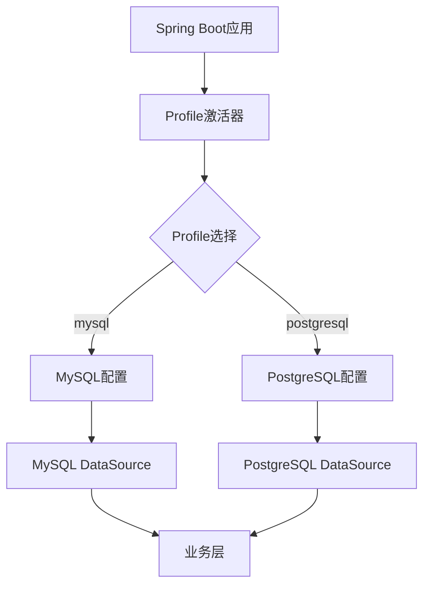

## Product Overview

为现有Spring Boot项目添加PostgreSQL数据库支持，通过Spring Profile实现MySQL和PostgreSQL数据库的动态切换机制，确保现有功能完全保持不变。

## Core Features

- 配置双数据库Profile（mysql和postgresql）
- 实现数据库连接的动态切换
- 保持现有业务逻辑不变
- 支持通过启动参数激活不同数据库Profile
- 确保两种数据库的SQL兼容性

## Tech Stack

- Spring Boot框架
- Spring Profile配置管理
- MySQL数据库驱动
- PostgreSQL数据库驱动
- Spring Data JPA/Hibernate
- Maven/Gradle构建工具

## System Architecture

采用Spring Profile实现多数据源配置，通过环境变量或启动参数动态切换数据库连接。



## Module Division

- **配置模块**: 管理不同数据库的连接配置
- **数据源模块**: 根据Profile动态创建数据源
- **实体模块**: JPA实体类，确保跨数据库兼容性
- **业务模块**: 现有业务逻辑，无需修改

## Data Flow


## Implementation Details

### Core Directory Structure

```
src/main/resources/
├── application.yml              # 公共配置
├── application-mysql.yml        # MySQL专用配置
└── application-postgresql.yml   # PostgreSQL专用配置

src/main/java/com/example/
├── config/
│   ├── DatabaseConfig.java      # 数据源配置
│   └── JpaConfig.java           # JPA配置
├── entity/                      # 实体类
├── repository/                  # 数据访问层
└── service/                     # 业务层
```

### Key Code Structures

```java
// 数据库配置类
@Configuration
public class DatabaseConfig {
    
    @Bean
    @Profile("mysql")
    public DataSource mysqlDataSource() {
        // MySQL数据源配置
    }
    
    @Bean
    @Profile("postgresql")
    public DataSource postgresqlDataSource() {
        // PostgreSQL数据源配置
    }
}
```

### Technical Implementation Plan

1. **配置双Profile**: 创建mysql和postgresql配置文件
2. **数据源配置**: 实现基于Profile的数据源Bean
3. **驱动依赖**: 添加PostgreSQL驱动依赖
4. **SQL兼容性**: 确保HQL/SQL在两种数据库中兼容
5. **测试验证**: 分别测试两种数据库连接

### Integration Points

- 数据库连接池配置
- JPA/Hibernate方言设置
- 应用启动参数传递
- 环境变量配置

## Technical Considerations

### Performance Optimization

- 使用连接池优化数据库连接
- 配置合适的JPA批处理大小
- 监控两种数据库的性能表现

### Security Measures

- 数据库连接加密
- 敏感配置信息使用环境变量
- 数据库访问权限控制

### Scalability

- 支持未来添加更多数据库类型
- 配置文件模块化管理
- 数据库切换的热更新支持

### Development Workflow

- 本地开发使用MySQL、PgSQL
- 生产环境根据需求选择数据库

此项目为后端Spring Boot应用，不涉及前端UI设计，主要关注数据库配置和后端架构实现。

## Agent Extensions

### MCP

- **PostgreSQL Multi-Schema MCP Server** (from <mcp>)
- Purpose: 连接和测试PostgreSQL数据库配置
- Expected outcome: 验证PostgreSQL连接配置正确性和多模式支持

### SubAgent

- **code-explorer** (from <subagent>)
- Purpose: 分析现有Spring Boot项目结构和配置
- Expected outcome: 识别需要修改的配置文件和代码模块