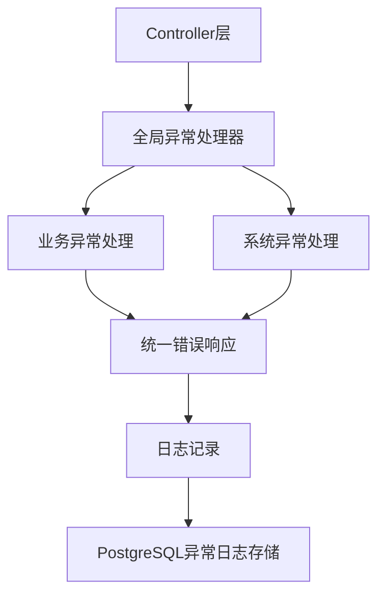
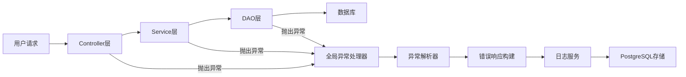

## Product Overview

建立健全异常处理机制方案，为Java项目建立完整的异常处理体系，包括全局异常处理器、自定义异常类、统一的错误响应格式和日志记录机制。

## Core Features

- 实现全局异常处理器，统一捕获和处理所有Controller层异常
- 创建自定义异常类体系，区分业务异常和系统异常
- 建立统一的错误响应格式，规范API错误信息返回
- 完善异常日志记录机制，便于问题追踪和系统监控
- 集成异常处理与PostgreSQL数据库操作，确保数据库操作异常的正确处理

## Tech Stack

- 基础框架: Spring Boot + Java
- 数据库: PostgreSQL (通过MCP集成)
- 日志框架: Logback/SLF4J
- 注解处理: Spring AOP
- JSON处理: Jackson
- 构建工具: Maven

## Architecture Design

### System Architecture

采用分层架构模式，异常处理贯穿各个层次：



### Module Division

- **exception-core**: 核心异常处理模块
- 全局异常处理器类
- 自定义异常基类
- 错误响应格式定义
- **exception-business**: 业务异常模块
- 业务异常类定义
- 异常码枚举
- **exception-system**: 系统异常模块
- 系统异常类定义
- 数据库异常处理
- **exception-logging**: 日志记录模块
- 异常日志记录服务
- 日志格式化处理

### Data Flow



## Implementation Details

### Core Directory Structure

```
src/main/java/com/fgshd/
├── exception/
│   ├── handler/
│   │   ├── GlobalExceptionHandler.java
│   │   └── DatabaseExceptionHandler.java
│   ├── core/
│   │   ├── BaseException.java
│   │   ├── ErrorResponse.java
│   │   └── ErrorCode.java
│   ├── business/
│   │   ├── BusinessException.java
│   │   └── BusinessErrorCode.java
│   └── system/
│       ├── SystemException.java
│       └── DatabaseException.java
├── logging/
│   ├── ExceptionLogService.java
│   └── ExceptionLogRepository.java
└── config/
    └── ExceptionConfig.java
```

### Key Code Structures

```java
// 全局异常处理器
@RestControllerAdvice
public class GlobalExceptionHandler {
    
    @ExceptionHandler(BusinessException.class)
    public ResponseEntity<ErrorResponse> handleBusinessException(BusinessException e) {
        // 处理业务异常
    }
    
    @ExceptionHandler(SystemException.class)
    public ResponseEntity<ErrorResponse> handleSystemException(SystemException e) {
        // 处理系统异常
    }
    
    @ExceptionHandler(Exception.class)
    public ResponseEntity<ErrorResponse> handleGenericException(Exception e) {
        // 处理通用异常
    }
}

// 自定义异常基类
public abstract class BaseException extends RuntimeException {
    private final ErrorCode errorCode;
    private final String message;
    
    public BaseException(ErrorCode errorCode, String message) {
        super(message);
        this.errorCode = errorCode;
        this.message = message;
    }
}

// 错误响应格式
public class ErrorResponse {
    private String code;
    private String message;
    private String details;
    private Long timestamp;
}
```

### Technical Implementation Plan

1. **全局异常处理器实现**

- 创建GlobalExceptionHandler类，使用@RestControllerAdvice注解
- 实现对不同类型异常的分类处理
- 统一错误响应格式

2. **自定义异常类体系**

- 创建BaseException基类
- 实现BusinessException和SystemException
- 定义异常码枚举

3. **日志记录机制**

- 集成Logback日志框架
- 创建异常日志记录服务
- 通过PostgreSQL MCP存储异常日志

### Integration Points

- 与Spring Boot集成，使用AOP实现全局异常捕获
- 与PostgreSQL MCP集成，存储异常日志数据
- 与现有Controller层集成，替换现有try-catch块

## Agent Extensions

### MCP

- **PostgreSQL Multi-Schema MCP Server**
- Purpose: 存储和管理异常日志数据，建立异常追踪数据库
- Expected outcome: 创建异常日志表结构，实现异常数据的持久化存储和查询

### SubAgent

- **code-explorer**
- Purpose: 探索现有项目结构，分析当前异常处理现状
- Expected outcome: 识别项目中的Controller类和现有异常处理代码，为全局异常处理器实现提供基础