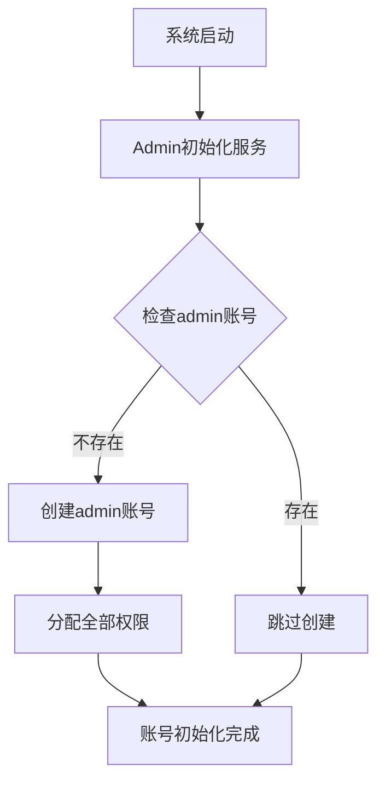
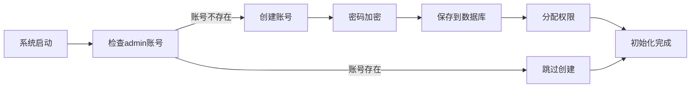

## Product Overview

实现一个系统启动时的管理员账号自动初始化功能，确保系统始终拥有一个可用的默认管理员账号。

## Core Features

- 系统启动时自动检查管理员账号是否存在
- 如果不存在则创建默认管理员账号（用户名：admin，密码：admin123）
- 如果已存在则跳过创建过程
- 为该账号分配系统全部权限
- 固定账号信息，不依赖配置文件设置

## Tech Stack

- 后端框架：基于现有Java项目架构
- 数据库：PostgreSQL（使用提供的MCP连接）
- 密码加密：BCrypt或类似的加密算法
- 权限管理：Spring Security或自定义权限框架
- 启动初始化：Spring Boot ApplicationRunner或CommandLineRunner

## Architecture Design

### System Architecture



### Module Division

- **AdminInitService**: 核心初始化服务，负责检查和创建管理员账号
- **UserService**: 用户管理服务，提供账号创建和查询功能
- **PermissionService**: 权限管理服务，处理权限分配
- **DatabaseInitializer**: 数据库初始化组件，确保表结构存在

### Data Flow



## Implementation Details

### Core Directory Structure

```
src/main/java/
├── config/
│   └── AdminInitializer.java    # 启动时初始化配置
├── service/
│   ├── AdminInitService.java    # 管理员初始化服务
│   ├── UserService.java         # 用户服务
│   └── PermissionService.java   # 权限服务
├── entity/
│   ├── User.java               # 用户实体
│   └── Permission.java         # 权限实体
└── repository/
    ├── UserRepository.java     # 用户数据访问
    └── PermissionRepository.java # 权限数据访问
```

### Key Code Structures

```java
// 管理员初始化服务
@Service
public class AdminInitService {
    private static final String ADMIN_USERNAME = "admin";
    private static final String ADMIN_PASSWORD = "admin123";
    
    @Autowired
    private UserRepository userRepository;
    
    @Autowired
    private PasswordEncoder passwordEncoder;
    
    @EventListener(ApplicationReadyEvent.class)
    public void initializeAdmin() {
        if (!userRepository.existsByUsername(ADMIN_USERNAME)) {
            createAdminUser();
        }
    }
    
    private void createAdminUser() {
        User admin = new User();
        admin.setUsername(ADMIN_USERNAME);
        admin.setPassword(passwordEncoder.encode(ADMIN_PASSWORD));
        admin.setRoles(Arrays.asList("ROLE_ADMIN", "ROLE_USER"));
        userRepository.save(admin);
    }
}
```

### Technical Implementation Plan

1. **创建管理员初始化服务**: 实现检查和创建逻辑
2. **密码加密存储**: 使用BCrypt加密密码
3. **权限分配机制**: 确保账号拥有所有必要权限
4. **启动时触发**: 使用Spring Boot的事件机制
5. **异常处理**: 添加适当的错误处理和日志记录

### Integration Points

- **PostgreSQL数据库**: 通过MCP连接执行SQL操作
- **Spring Security**: 集成权限管理框架
- **应用启动事件**: 绑定到应用生命周期

## Agent Extensions

### MCP

- **PostgreSQL Multi-Schema MCP Server**
- Purpose: 连接PostgreSQL数据库执行账号检查和创建操作
- Expected outcome: 成功执行数据库查询和插入操作，确保管理员账号正确创建和权限分配

### SubAgent

- **code-explorer**
- Purpose: 探索现有Java项目结构，了解当前的用户管理和权限系统实现
- Expected outcome: 找到相关的实体类、服务类和配置文件，为管理员初始化功能提供集成点